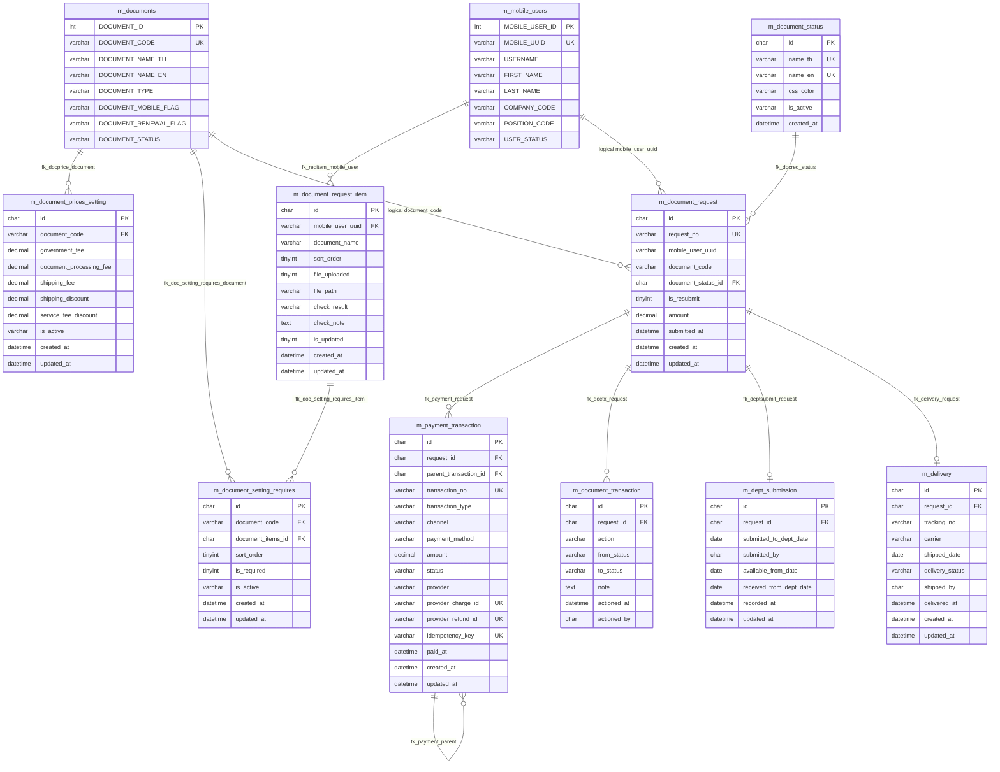
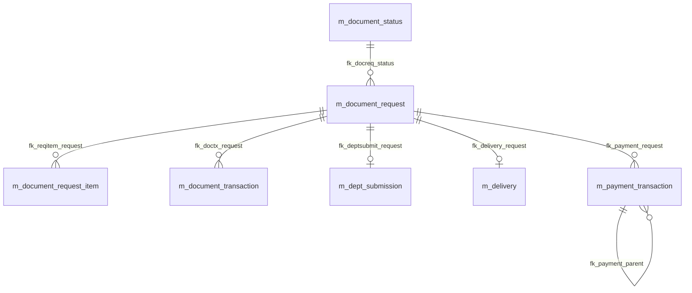

# Smart Seaman Table Diagram

แหล่งอ้างอิง:
- `documents/mvp1/non_prod_db_schema.md`
- `documents/mvp1/script/RUN1_2026_create_table.sql`

หมายเหตุ:
- Diagram นี้รวม schema เดิมจาก non-prod และ table/column ที่เพิ่มใน `RUN1_2026_create_table.sql`
- ความสัมพันธ์ที่มี FK จริงใน SQL แสดงเป็น relationship ปกติ
- ความสัมพันธ์ที่เป็น logical reference แต่ยังไม่ได้ประกาศ FK จริง แสดงด้วย label `logical`

---

## Document Renewal ERD

---

## Declared FK Diagram From Non-Prod Schema

---

## Table Inventory From Non-Prod Schema

| Group | Tables |
|---|---|
| User and auth | `m_admin_users`, `m_mobile_users`, `t_session`, `t_forgot_password` |
| Permission | `m_groups`, `m_groups_map_autholist`, `m_menus`, `m_menus_map_permission`, `m_permission` |
| Master data | `m_companys`, `m_positions`, `m_documents`, `m_configurations`, `m_message_code` |
| Course and certificate | `m_course_name`, `m_courses`, `m_course_dates`, `m_certificates` |
| Content | `m_banners`, `m_news`, `m_forms` |
| Notification | `m_fcm_notifications`, `m_send_notifications`, `m_send_notifications_backup` |
| Voucher | `m_vouchers`, `m_voucher_details` |
| Document renewal | `m_document_status`, `m_document_request`, `m_document_prices_setting`, `m_payment_transaction`, `m_document_request_item`, `m_document_transaction`, `m_dept_submission`, `m_delivery` |
| Transaction logs | `t_transaction_logs`, `t_transaction_logs_offline`, `t_txn_to_other_system` |

---

## RUN1 Additions And Changes

| Object | Change |
|---|---|
| `m_documents` | เพิ่ม `DOCUMENT_RENEWAL_FLAG VARCHAR(3) DEFAULT 'NO'` เพื่อระบุว่าเอกสารต่ออายุได้หรือไม่ |
| `m_document_status` | ใช้ `name_th`, `name_en`, `css_color`, `is_active` สำหรับ status master |
| `m_document_prices_setting` | เก็บราคาโดยอ้างอิง `m_documents.DOCUMENT_CODE`; ไม่เก็บชื่อเอกสารซ้ำ |
| `m_document_request_item` | ผูกกับ `m_mobile_users.MOBILE_UUID` แทนการผูกกับ `m_document_request` |
| `m_document_setting_requires` | table ใหม่สำหรับกำหนดว่า document แต่ละประเภทต้องใช้ document item ใดบ้าง |

---

## Key Relationship Notes

| From | To | Type | Note |
|---|---|---|---|
| `m_document_request.document_status_id` | `m_document_status.id` | FK | สถานะปัจจุบันของ request |
| `m_document_request.document_code` | `m_documents.DOCUMENT_CODE` | logical | ใน `RUN1` ยังไม่ได้ประกาศ FK เพราะ column type ยังเป็น `VARCHAR(50)` |
| `m_document_request.mobile_user_uuid` | `m_mobile_users.MOBILE_UUID` | logical | ใน `RUN1` ยังไม่ได้ประกาศ FK เพราะ column type ยังเป็น `VARCHAR(50)` |
| `m_document_prices_setting.document_code` | `m_documents.DOCUMENT_CODE` | FK | ราคาเอกสารต่อ document code |
| `m_document_request_item.mobile_user_uuid` | `m_mobile_users.MOBILE_UUID` | FK | item เอกสารประกอบของผู้ใช้ |
| `m_document_setting_requires.document_code` | `m_documents.DOCUMENT_CODE` | FK | mapping document ไปยัง required item |
| `m_document_setting_requires.document_items_id` | `m_document_request_item.id` | FK | mapping ไปยัง item ที่ต้องใช้ |
| `m_payment_transaction.request_id` | `m_document_request.id` | FK | payment หลายรายการต่อ request |
| `m_document_transaction.request_id` | `m_document_request.id` | FK | audit timeline หลายรายการต่อ request |
| `m_dept_submission.request_id` | `m_document_request.id` | FK, UK | 1 request ต่อ 1 dept submission |
| `m_delivery.request_id` | `m_document_request.id` | FK, UK | 1 request ต่อ 1 delivery |
